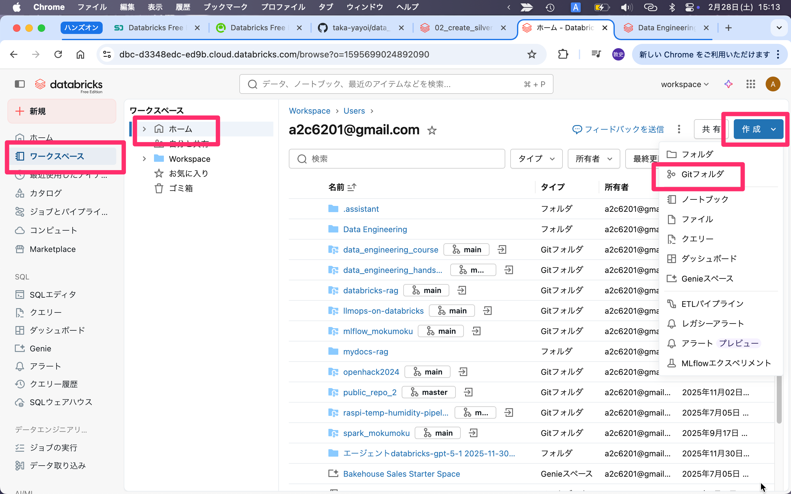
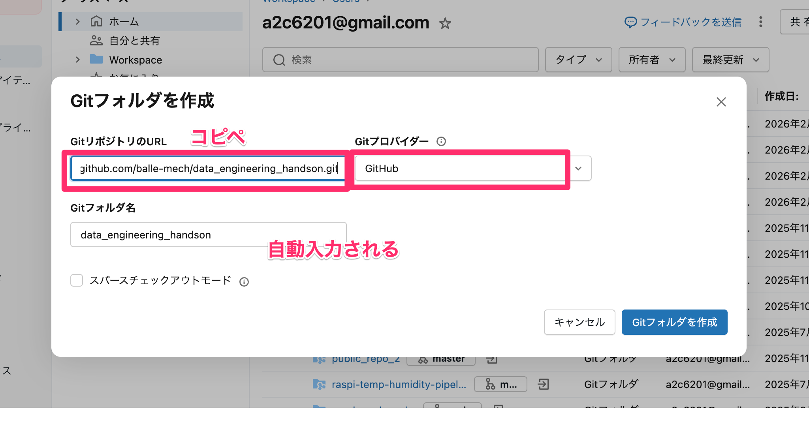
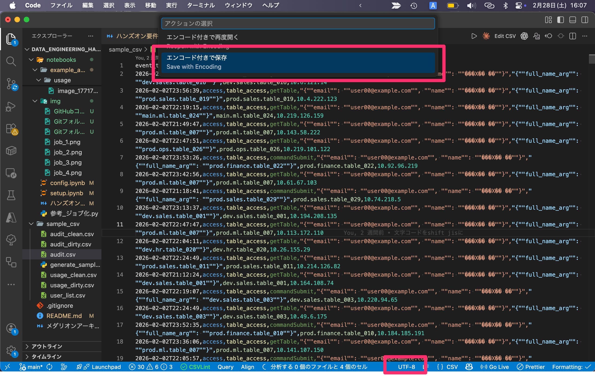
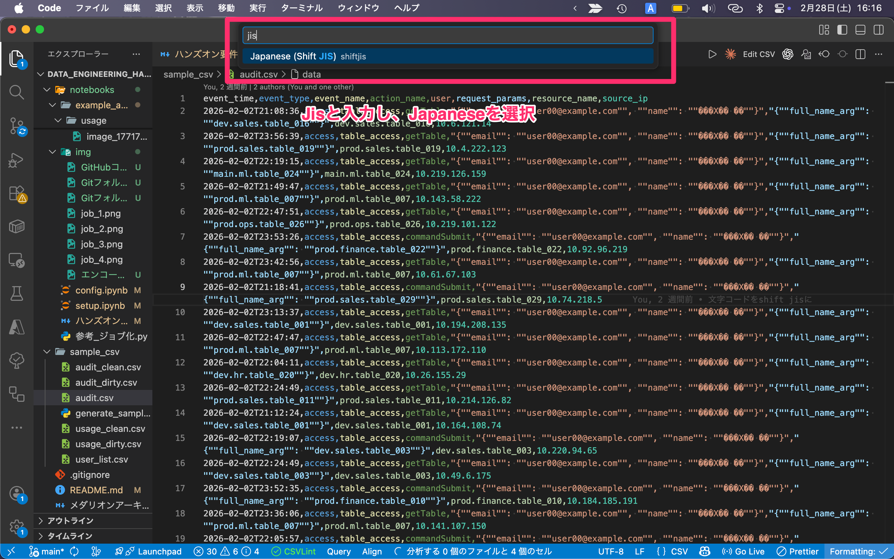

# 受講者向けハンズオンガイド（Notebook編）

## このハンズオンで最終的に作るもの（BIゴール）

- 目的: `監査ログ(audit)` と `課金実績(usage)` を統合し、**誰が・何を・どれだけ使ったか**を可視化できるテーブルの作成
  - BIダッシュボードは対象外
- 扱うデータ
  - `audit_dirty.csv`：ログ
  - `usage_dirty.csv`：利用料
  - `user_list.csv`：ユーザー一覧
- 主な分析テーマ例
  - 全体サマリ
    - 日次別DBU、日次アクティブユーザー、日次アクセス数
  - ユーザー分析
    - ユーザー別利用量（DBU）ランキング
    - workspaceごとの利用料
  - リソース分析
    - テーブル別アクセス数、利用ユーザー数

## 全体アーキテクチャ（Medallion）

本ハンズオンは「メダリオンアーキテクチャ参考.md」の考え方をベースに進めますが、  
どこまで厳密に各レイヤー（Bronze/Silver/Gold）を適用するかは、皆様の設計判断でもよいです。  

そのため、すべてのデータソースで3層すべてのテーブル作成を必須とはしません。  
例えば `user_list` は、用途に応じて Delta テーブル化のみ（追加クレンジングなし）でも問題ありません。

## 実装手順

1. Auditのブロンズ・シルバー・ゴールド作成
3. 余力があれば）Usageのブロンズ・シルバー・ゴールド作成
4. 余力があれば）サマリテーブル作成
5. 余力があれば）user_list作成し、Goldテーブルに取り込み

## フォルダ説明

ハンズオン（Notebook編）では、notebooksフォルダ配下のファイルを使用します。  

```
notebooks/
├── ハンズオンガイド(Notebook編).md   # 本資料です
├── audit/                         # このフォルダのNotebookでauditデータのハンズオンを実施いただきます。
│   └── XX_create_silver ...
├── usage/                         # このフォルダのNotebookでusageデータのハンズオンを実施いただきます。
│   └── XX_create_silver ...
├── example_answer/                # 正解例・サンプルコード
│   ├── audit/
│   └── usage/
└── img/                           # 解説用の画像ファイル
```

参照：[README.md - フォルダ構造](https://github.com/balle-mech/data_engineering_handson/blob/main/README.md#%E3%83%95%E3%82%A9%E3%83%AB%E3%83%80%E6%A7%8B%E9%80%A0)

## ハンズオン準備手順

### GitHubからハンズオンコードを教育環境に持ってくる

以下リンクをコピー

> https://github.com/balle-mech/data_engineering_handson.git



コピーしたリンクを貼り付け



### CSVファイルを取り込み

1. `変数設定.ipynb`でカタログ・スキーマ名などを設定
2. `スキーマ・ボリューム作成.ipynb`でスキーマ・ボリュームを作成
3. CSVファイルを各フォルダに格納

**トラブルシューティング）文字化けしてしまった場合**

VSCodeで開いたとき、日本語が文字化けしてしまうことがあります。

```csv
event_time,event_type,event_name,action_name,user,request_params,resource_name,source_ip
2026-02-02T21:08:36,access,table_access,getTable,"{""email"": ""user00@example.com"", ""name"": ""���X�� ��""}","{""full_name_arg"": ""dev.sales.table_016""}",dev.sales.table_016,10.6.121.14
2026-02-02T23:56:39,access,table_access,getTable,"{""email"": ""user00@example.com"", ""name"": ""���X�� ��""}","{""full_name_arg"": ""prod.sales.table_019""}",prod.sales.table_019,10.4.222.123
```

（userカラムのname部分）

文字コードがUTF-8（）で表示されていることが原因であれば、以下手順でShisft JIS（日本語）に変更することで解消するかもしれません。
**注意：**既に文字化けした状態で保存までされている場合は、この操作では解消できないです。

画面下の「UTF-8」をクリック、「エンコード付きで保存を選択」




## スキーマ設計（目標）

### Silver Audit（例）

- 主キー候補: `event_id`
- 必須カラム:
  - `event_id` STRING
  - `event_time` TIMESTAMP
  - `action_name` STRING
  - `user_email` STRING（`user` JSON展開）
  - `user_name` STRING（`user` JSON展開）
  - `resource_name` STRING
  - `full_name_arg` STRING（`request_params` JSON展開）
  - `_ingest_timestamp` TIMESTAMP

### Silver Usage（例）

- 主キー候補: `record_id`
- 必須カラム:
  - `record_id` STRING
  - `usage_start_time` TIMESTAMP
  - `usage_end_time` TIMESTAMP
  - `usage_quantity` DOUBLE
  - `workspace_id` STRING
  - `user_email` STRING（`identity_metadata` JSON展開）
  - `_ingest_timestamp` TIMESTAMP

### Silver User（例）

- 主キー: `email`
- 必須カラム:
  - `email` STRING
  - `last_name` STRING
  - `first_name` STRING
  - `department_1` STRING
  - `department_2` STRING

## Silverで実装したい加工要件

### JSON展開

- audit:
  - `user` から `user_email`, `user_name`
  - `request_params` から `full_name_arg`
- usage:
  - `identity_metadata` から `user_email`

### explode（必要に応じて別テーブル化）

- `resource_name` または `full_name_arg` を `.` 分割し、`catalog/schema/table` 単位に展開
- 1イベント1行を保ちたい場合、explode結果は別Silverサブテーブルに保存

### データ品質補正

- null除去:
  - audit: `event_time`, `action_name`, `user_email` がnullの行を除外
  - usage: `usage_start_time`, `usage_end_time`, `usage_quantity`, `user_email` がnull/空の行を除外
- 先頭空白除去:
  - `ltrim` を `action_name`, `resource_name`, `user_email` へ適用
- 重複除去:
  - 基本は `event_id` / `record_id` 単位で重複排除

## Gold 設計イメージ

### テーブル別アクセス数・利用ユーザー数（リソース分析）

`gold_audit_table_daily`

目的：テーブル別アクセス数、利用ユーザー数（リソース分析）
スキーマ例：

```
event_date DATE                          # 監査ログ基準日（日単位）
table_name STRING                        # アクセス対象テーブル名
audit_event_count LONG                   # テーブルへの総アクセス回数
distinct_user_count LONG                 # そのテーブルにアクセスしたユニークユーザー数
get_table_count LONG                     # getTable操作回数
command_submit_count LONG                # commandSubmit操作回数
```

### workspace×日次の利用量（＝「workspaceごとの利用料」）

`gold_usage_workspace_daily`

目的：workspaceごとのDBU推移・ランキング

```
usage_date DATE                          # 利用基準日（日単位）
workspace_id LONG                        # Databricks Workspace識別子
total_usage_quantity DOUBLE              # そのworkspaceの1日合計DBU
active_users LONG                        # そのworkspaceを利用したユニークユーザー数
usage_record_count LONG                  # usageレコード件数（利用イベント数）
```

### 日次全体サマリ（DBU・DAU・アクセス数）

`gold_platform_daily_summary`

目的：日次別DBU、日次アクティブユーザー、日次アクセス数を1枚で出す

```
date DATE                                # 集計基準日（日単位）
total_usage_quantity DOUBLE              # その日の全workspace合計DBU
usage_daily_active_users LONG            # usageが発生したユニークユーザー数
usage_record_count LONG                  # usageレコード件数
audit_event_count LONG                   # 監査ログ操作総数
audit_daily_active_users LONG            # 監査ログ上のユニークユーザー数
distinct_resource_count LONG             # アクセスされたユニークリソース数
get_table_count LONG                     # getTable操作回数
command_submit_count LONG                # commandSubmit操作回数
```

## 受講者向けチェックリスト

- `event_id` / `record_id` で重複排除できているか
- `user_email` の空白削除(trim)漏れがないか
- `usage_quantity` が数値型か
- Goldで部署別・ユーザー別の利用量が集計できる
- 作成したデータで「誰が何をどれだけ使ったか」が分かるBIを作成できる
