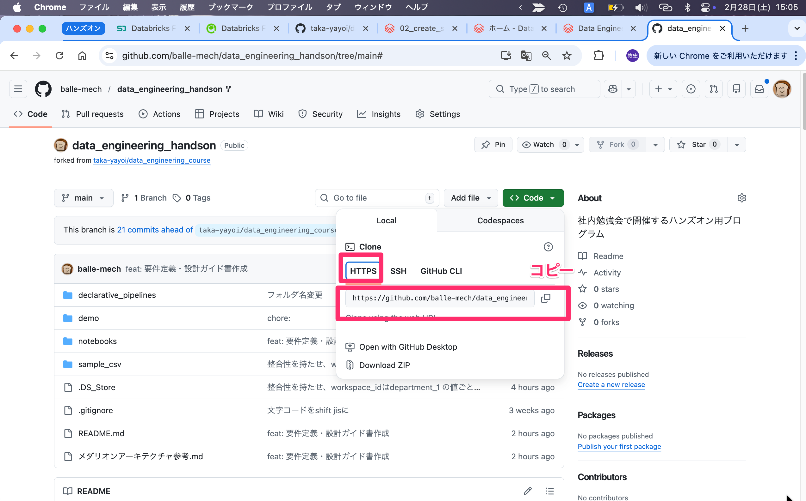

# Databricksハンズオン 要件定義・設計ガイド（受講者向け）

## このハンズオンで最終的に作るもの（BIゴール）

- 目的: `監査ログ(audit)` と `課金実績(usage)` を統合し、**誰が・何を・どれだけ使ったか**を可視化する
- 最終アウトプット: BIダッシュボード（Databricks SQL / Power BI / Tableau 想定）
- 扱うデータ
  - `audit_dirty.csv`：ログ
  - `usage_dirty.csv`：利用料
  - `user_list.csv`：ユーザー一覧
- 主な分析テーマ
  - 全体サマリ
    - 日次別DBU、日次アクティブユーザー、日次アクセス数
  - ユーザー分析
    - ユーザー別利用量（DBU）ランキング
    - 応用：部署ごとの利用料
  - リソース分析
    - テーブル別アクセス数、利用ユーザー数

## 全体アーキテクチャ（Medallion）

本ハンズオンは「メダリオンアーキテクチャ参考.md」の考え方をベースに進めますが、
どこまで厳密に各レイヤー（Bronze/Silver/Gold）を適用するかは、皆様の設計判断でもよいです。
そのため、すべてのデータソースで3層すべてのテーブル作成を必須とはしません。
例えば `user_list` は、用途に応じて Delta テーブル化のみ（追加クレンジングなし）でも問題ありません。

## GitHubからハンズオンコードを教育環境に持ってくる




## CSVファイルを取り込み

1. `config.ipynb`でカタログ・スキーマ名などを設定
2. `setup.ipynb`でスキーマ・ボリュームを作成
3. CSVファイルを各ディレクトリに格納

**文字化けしてしまった場合**

VSCodeで開いたとき、日本語が文字化けしてしまうことがあります。

```csv
event_time,event_type,event_name,action_name,user,request_params,resource_name,source_ip
2026-02-02T21:08:36,access,table_access,getTable,"{""email"": ""user00@example.com"", ""name"": ""���X�� ��""}","{""full_name_arg"": ""dev.sales.table_016""}",dev.sales.table_016,10.6.121.14
2026-02-02T23:56:39,access,table_access,getTable,"{""email"": ""user00@example.com"", ""name"": ""���X�� ��""}","{""full_name_arg"": ""prod.sales.table_019""}",prod.sales.table_019,10.4.222.123
```

（userカラムのname部分）

文字コードがUTF-8（）で表示されていることが原因であれば、以下手順でShisft JIS（日本語）に変更することで解消するかもしれません。
**注意：**既に文字化けした状態で保存までされている場合は、この操作では解消できないです。

画面下の「UTF-8」をクリック、「エンコード付きで保存を選択」


## スキーマ設計（目標）

### Silver Audit（例）

- 主キー候補: `event_id`
- 必須カラム:
  - `event_id` STRING
  - `event_time` TIMESTAMP
  - `action_name` STRING
  - `user_email` STRING（`user` JSON展開）
  - `user_name` STRING（`user` JSON展開）
  - `resource_name` STRING
  - `full_name_arg` STRING（`request_params` JSON展開）
  - `_ingest_timestamp` TIMESTAMP

### Silver Usage（例）

- 主キー候補: `record_id`
- 必須カラム:
  - `record_id` STRING
  - `usage_start_time` TIMESTAMP
  - `usage_end_time` TIMESTAMP
  - `usage_quantity` DOUBLE
  - `workspace_id` LONG
  - `user_email` STRING（`identity_metadata` JSON展開）
  - `_ingest_timestamp` TIMESTAMP

### Silver User（例）

- 主キー: `email`
- 必須カラム:
  - `email` STRING
  - `last_name` STRING
  - `first_name` STRING
  - `department_1` STRING
  - `department_2` STRING

## Silverで実装したい加工要件

### JSON展開

- audit:
  - `user` から `user_email`, `user_name`
  - `request_params` から `full_name_arg`
- usage:
  - `identity_metadata` から `user_email`

### explode（必要に応じて別テーブル化）

- `resource_name` または `full_name_arg` を `.` 分割し、`catalog/schema/table` 単位に展開
- 1イベント1行を保ちたい場合、explode結果は別Silverサブテーブルに保存

### データ品質補正

- null除去:
  - audit: `event_time`, `action_name`, `user_email` がnullの行を除外
  - usage: `usage_start_time`, `usage_end_time`, `usage_quantity`, `user_email` がnull/空の行を除外
- 先頭空白除去:
  - `ltrim` を `action_name`, `resource_name`, `user_email` へ適用
- 重複除去:
  - 基本は `event_id` / `record_id` 単位で重複排除
  - 追加で業務キー重複がある場合、`_ingest_timestamp` の最新レコードを採用
- カラムずれ対策:
  - Bronze取り込み時に `rescued_data` や検疫テーブルを使う
  - Silverでは不正行を除外し、件数を監視

## Gold（BI用）設計イメージ

### gold_user_usage_daily

- 粒度: `date x user_email`
- 指標:
  - `total_dbu`
  - `access_event_count`
  - `distinct_resource_count`

### gold_department_usage_daily

- 粒度: `date x department_1`
- 指標:
  - `total_dbu`
  - `active_user_count`
  - `access_event_count`

### gold_resource_access_daily

- 粒度: `date x resource_name`
- 指標:
  - `access_count`
  - `distinct_user_count`
  - `related_dbu`（join可能な範囲で配賦）

## 実装手順（受講者ガイド）

1. Bronzeテーブル作成（raw取り込み）
2. Silver Audit作成（JSON展開・trim・null/重複除去）
3. Silver Usage作成（JSON展開・型変換・null/重複除去）
4. Gold集計テーブル作成
5. 余力があれば）Silver User作成（型・キー整備）し、Goldテーブルに取り込み

## 受講者向けチェックリスト

- `event_id` / `record_id` で重複排除できているか
- `user_email` の空白削除(trim)漏れがないか
- `usage_quantity` が数値型か
- Goldで部署別・ユーザー別の利用量が集計できる
- 作成したデータで「誰が何をどれだけ使ったか」が分かるBIを作成できる
